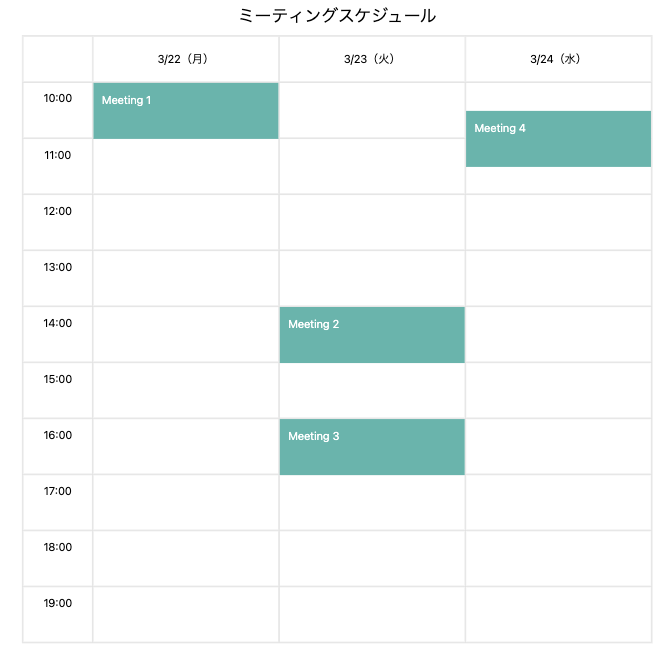

## セットアップ

composer install
cp .env.example .env
php artisan key:generate

npm install
npm run dev

php artisan serve

## 実装内容

- Laravel API を経由して外部APIへアクセス
- User-Agent を 設定
- APIレスポンスをログへ記録
- Vue3 を利用してカレンダーUIを実装
- APIレスポンスをフロント向けに整形

## 技術スタック

- PHP 8.2
- Laravel
- Vue3
- Axios
- Vite

## スクリーンショット
